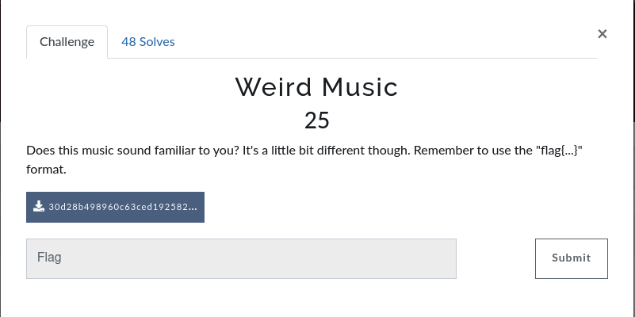
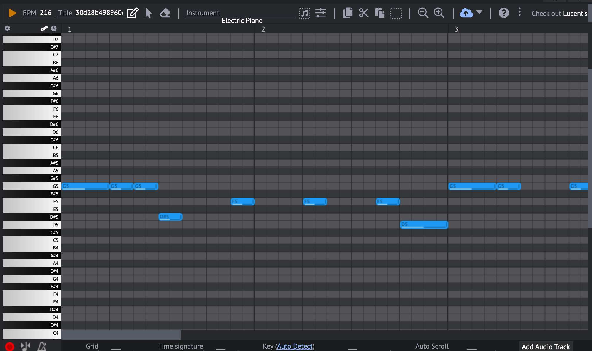
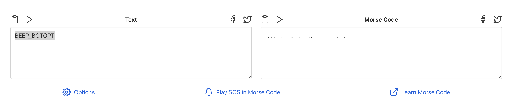

# Weird Music
> Fun fact : This is quite an easy challenge if you have work with music files, producers, or composers before ... :D
- 	Let’s start the challenge, we have a .mid file and a description as below:

- After downloading, [here](https://github.com/banhmingusi/MHSCTF2022-Write-ups/blob/ab0a5d54c8d9d788a67d66c7f411844de9b362a3/Cryptography/Weird%20Music/30d28b498960c63ced19258245b2bee3.mid) what in that file : 

- Nice! this is a file with `.mid` extention ==> midi file (The file recording notes on music sheet by midi devices or musical instruments).
- Open it with a midi reader (or other some producer app...) ! Here I use [Online Sequencer](https://onlinesequencer.net/):
 
- This file shows some notes but all of them are in 2 types: long notes and short notes (as in the picture)
- I think it relates to `morse code` aso let's try this way :D 
- - Write the notes in `morse code` form, they will be like this:`-... . . .--. ..--.- -... --- - --- .--. -`
 
- - After decoding them, we have: BEEP_BOTOPT
- Flag : `flag{beep_botopt}`
